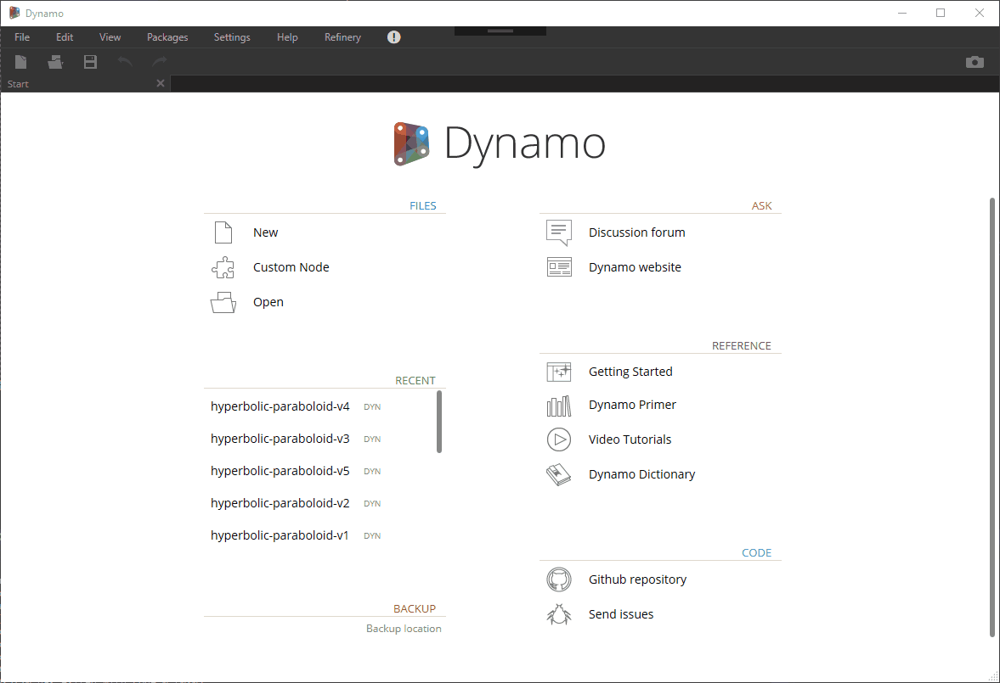
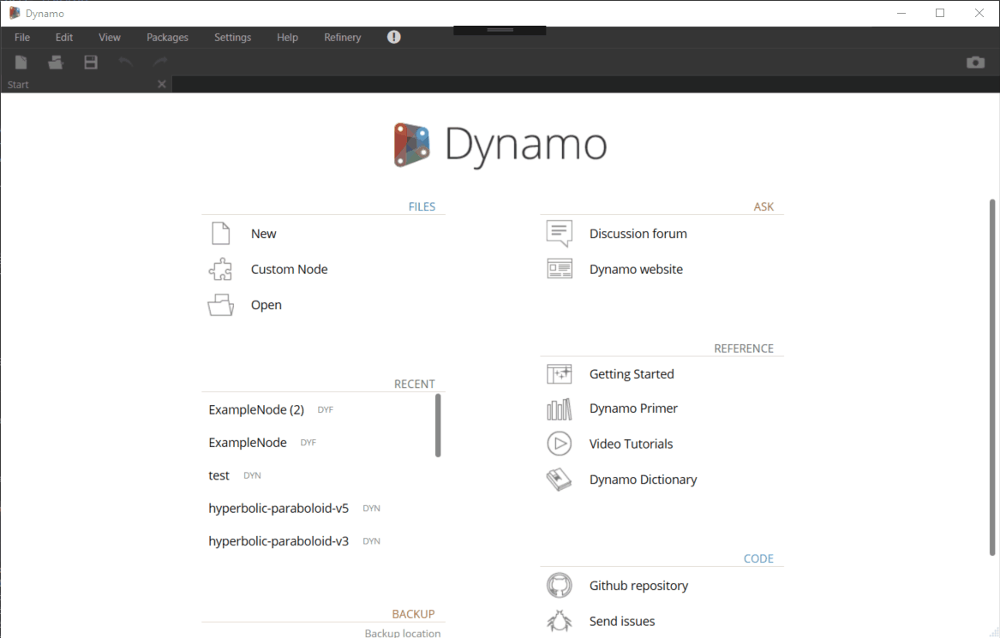
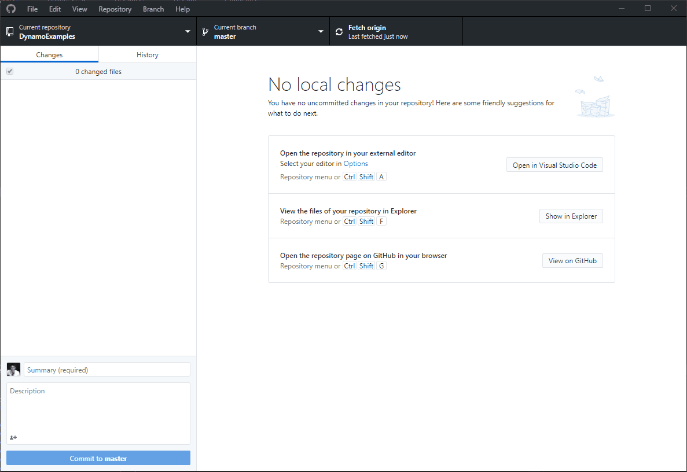

# Visual Diff for Dynamo

A View Extension for Dynamo to visually compare the differences between two Dynamo Graphs in order to improve collaborative workflows in visual programming.

The project was developed by Michael van Telgen, Robert Wood, and Laurence Elsdon (all representing Arcadis) at the Dynamo and Generative Design Hackathon in Toronto where it was awarded 2nd place!

- This will enable multiple developers collaborating on a single Dynamo graph to clearly communicate changes they are proposing

- Assist in replicating changes across a repository of graphs that all follow a similar pattern/foundation

- Provide an overview of the history of changes to a graph (to better understand why a graph is written as it is)

- Provide code reviewers a clear indication of changes to be assessed in QA review

- Clearly indicate additions/deletions/modifications that may be the result of human error thus quashing bugs before they proliferate

## Demo

### Compare two Dynamo Graphs

The following example shows an Dynamo Graph being opened, and then comapred to a reference graph selected using Visual Diff.

### Compare two Dynamo Custom Nodes

The next example shows a DYF being compared.

### Compare a Graph stored in a Git version control repository

The next example is a proof of concept to show that the extension can be adapted to read files from a Version Control system such as Git or Sharepoint - using this Git repository as an example: https://github.com/StudioLE/DynamoExamples.

